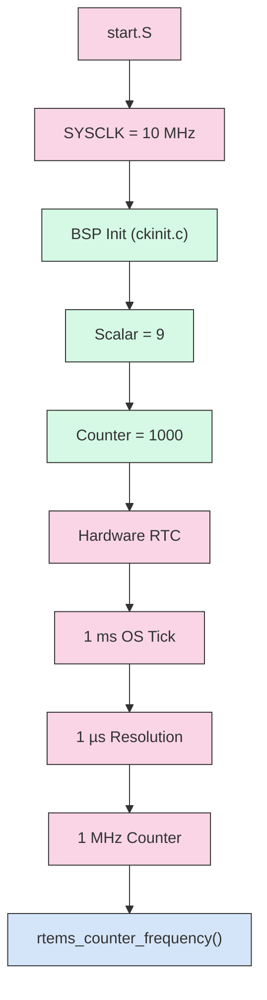
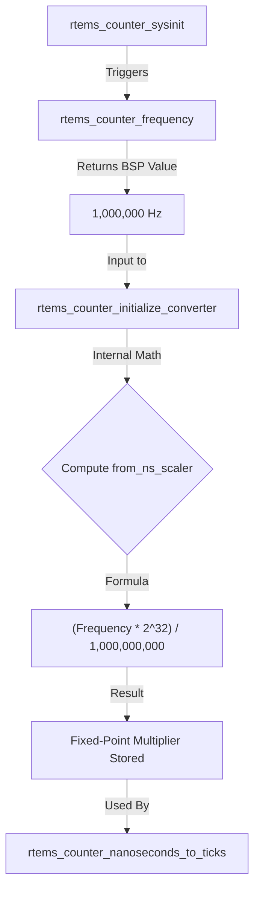
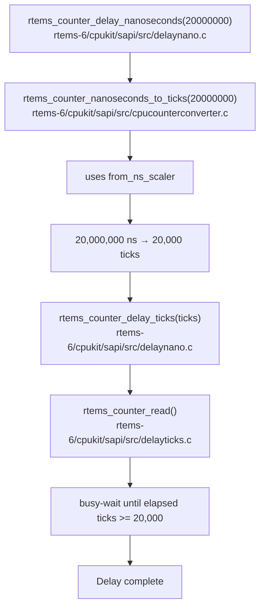
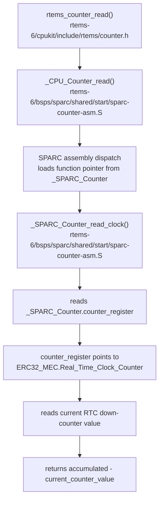
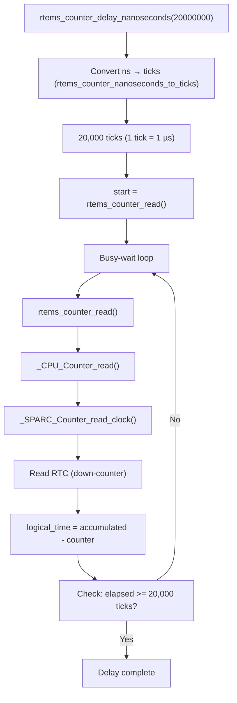

# Tutorial 12: Understanding of Counter API for Determinstic timing and EDF Scheduling
> **Goal:** Understanding Counter API and EDF Scheduling with preemption.

## Introduction 
In the previous tutorial, we used a software loop to mimic computation time and CPU workload. When executed on the SIS SPARC/ERC32 emulator, the loop produced consistent timing and was suitable for demonstrating EDF scheduling behavior. However, a software loop does not provide true hardware-based timing guarantees.


Because deterministic timing is a key goal of an RTOS, it is important to understand the hardware timing mechanisms provided by RTEMS. In this tutorial, we will explore the ```rtems_counter_delay_nanoseconds()``` [API ](https://docs.rtems.org/doxygen/5.1/group__ClassicCounter.html#gaa8fddf3e4ad1abb10170e61db04525ae).We will examine how it works by tracing its implementation through the RTEMS kernel, the BSP, and the ERC32 hardware. This will help us understand how RTEMS uses the real-time clock and counter infrastructure to provide precise timing and delay services. 


In this tutorial, we will use the custom-defined `cpu_work_run_ms()` API as a replacement for the previous software `for` loop.

This API is based on RTEMS counter concepts, such as `rtems_counter_read()` and ```rtems_counter_delay_nanoseconds()```. It provides a more deterministic way to simulate CPU workload compared to an artificial software loop.

Instead of depending on loop execution time, `cpu_work_run_ms()` models actual CPU execution time. This makes the workload simulation more suitable for RTEMS scheduling experiments and follows the timing concept explained in this tutorial.

### Difference between rtems_counter_delay_nanoseconds() and rtems_task_wake_after()

#### rtems_counter_delay_nanoseconds()

- It reads the Real-time Clock Timer Counter  in a tight loop.

- It consumes CPU while waiting; on a single-core system, lower-priority tasks cannot run during this delay.

- Higher-priority tasks can still preempt the spinning task.

- Very short hardware delays (e.g., waiting 300 mircosecond )

#### rtems_task_wake_after()


- It blocks the calling task for the specified number of clock ticks and invokes the scheduler to select another ready task.

- It consumes 0% CPU while blocked. The processor is free to execute other ready tasks or enter the idle task.

- Its resolution is limited by the system tick (`CONFIGURE_MICROSECONDS_PER_TICK`). For example, if the tick period is 1 ms, the smallest delay that can be requested is one tick (1 ms). Delays shorter than one tick, such as 500 ns, cannot be accurately achieved using `rtems_task_wake_after()`.


### Example  to understand rtems_counter_delay_nanoseconds() and overhead

In this section, we analyze the RTEMS Counter API and the overhead associated with rtems_counter_delay_nanoseconds(), using the example from [tutorial12_1](docs/12_1.zip).

The example consists of a single task with a period of 100 ms and a simulated workload of 20 ms. The delay is implemented using the Counter API. The objective is to verify whether the CPU remains busy for exactly 20 ms or if additional overhead is introduced by the API.

To evaluate this, we measure execution time and address the following questions:


- What is the current frequency of the Real-Time Clock (RTC)?
- What is the overhead of calling rtems_counter_read() immediately after the delay?
- What is the overhead introduced by the wrapper function used for time conversion from micro to nano?


### main.c

```bash
 #include <rtems.h>
#include <rtems/record.h>
#include <rtems/counter.h>
#include <stdio.h>

#define EVT_COUNT_A RTEMS_RECORD_USER(0)


rtems_id barrier_id;


void do_deterministic_work_microsecond(uint32_t microseconds) {
    uint64_t nanoseconds = (uint64_t)microseconds * 1000;
    rtems_counter_delay_nanoseconds(nanoseconds);
}

/* Task A: 100ms Period, 20ms Work */
    rtems_task Task_A(rtems_task_argument arg) {
    rtems_id rm_id;
    rtems_rate_monotonic_create(rtems_build_name('R','M','A',' '), &rm_id);
    while (1) {
    rtems_counter_ticks start = rtems_counter_read();
    rtems_counter_ticks end = rtems_counter_read();

        //rtems_counter_ticks baseline = end - start;
        rtems_rate_monotonic_period(rm_id, RTEMS_MILLISECONDS_TO_TICKS(100));
        rtems_record_produce(EVT_COUNT_A, 1); 
        start = rtems_counter_read();
       // rtems_counter_delay_nanoseconds(20000*1000);
        do_deterministic_work_microsecond(20000);
         end = rtems_counter_read();
         rtems_record_produce(EVT_COUNT_A, end - start - baseline);
         uint64_t ns = rtems_counter_ticks_to_nanoseconds(end - start - baseline);
         printf("Elapsed: %llu ns\n", ns);
       
    }
}


rtems_task Dump_Task(rtems_task_argument arg) {
    rtems_task_wake_after(RTEMS_MILLISECONDS_TO_TICKS(600));
    rtems_fatal_error_occurred(0xDEADBEEF);
}

rtems_task Init(rtems_task_argument arg) {
    printf("CPU Counter Frequency: %u Hz\n", rtems_counter_frequency());   ///1000000 Hz
    rtems_id ta, td;

  

    rtems_task_create(rtems_build_name('T','A',' ',' '), 10, 4096, RTEMS_DEFAULT_MODES, RTEMS_DEFAULT_ATTRIBUTES, &ta);
    
    rtems_task_create(rtems_build_name('D','U','M','P'), 1, 4096, RTEMS_DEFAULT_MODES, RTEMS_DEFAULT_ATTRIBUTES, &td);

    rtems_task_start(ta, Task_A, 0);
    rtems_task_start(td, Dump_Task, 0);
    rtems_task_delete(RTEMS_SELF);
}


 ```
### What is the current frequency of the Real-Time Clock (RTC)?

The RTC frequency is 1 MHz. This can be verified using rtems_counter_frequency(), and it is also visible in the trace logs as:


```bash
Timestamp	Channel	CPU	Event type	Contents	TID	Prio	PID	Source
02:11:35.966 467 999	stream_0	0	PER_CPU_COUNT	data=0x10000, context.packet_seq_num=0, context.cpu_id=0				
02:11:35.966 467 999	stream_0	0	FREQUENCY	data=0xf4240, context.packet_seq_num=0, context.cpu_id=0
 ```
 #### FREQUENCY data = 0xf4240  (1000000)

In the next section, we will explore the BSP and ERC32 datasheet in detail to understand how this 1 MHz frequency is configured.

### What is the overhead of calling rtems_counter_read() immediately after the delay?

To understand the actual overhead introduced by the Counter API, we first measure the total elapsed time around the delay call.

In the following code, we request a 20 ms delay:

```bash
start = rtems_counter_read();
rtems_counter_delay_nanoseconds(20000 * 1000);
end = rtems_counter_read();

rtems_record_produce(EVT_COUNT_A, end - start);

 ```
 
### logs


```bash
context.packet_seq_num=0, context.cpu_id=0	0	0		
02:11:36.264 371 999	stream_0	0	USER_0	data=0x1, context.packet_seq_num=0, context.cpu_id=0	167837698	0	167837698	
02:11:36.284 423 999	stream_0	0	USER_0	data=0x4e41, context.packet_seq_num=0, context.cpu_id=0	167837698	0	167837698	
02:11:36.284 588 999	stream_0	0	THREAD_STACK_CURRENT	data=0xda0, context.packet_seq_num=0, context.cpu_id=0	167837698	0	167837698	
02:11:36.284 588 999	stream_0	0	sched_switch	prev_comm="TA  ", prev_tid=167837698, prev_prio=0, prev_state=0, next_comm="IDLE/0", next_tid=0, next_prio=0, context.packet_seq_num=0, context.cpu_id=0	167837698	0	167837698	
02:11:36.364 304 999	stream_0	0	THREAD_STACK_CURRENT	data=0xd60, context.packet_seq_num=0, context.cpu_id=0	0	0		
02:11:36.364 304 999	stream_0	0	sched_switch	prev_comm="IDLE/0", prev_tid=0, prev_prio=0, prev_state=1026, next_comm="TA  ", next_tid=167837698, next_prio=0, context.packet_seq_num=0, context.cpu_id=0	0	0		
02:11:36.364 365 999	stream_0	0	USER_0	data=0x1, context.packet_seq_num=0, context.cpu_id=0	167837698	0	167837698	
02:11:36.384 413 999	stream_0	0	USER_0	data=0x4e3c, context.packet_seq_num=0, context.cpu_id=0	167837698	0	167837698	
02:11:36.384 578 999	stream_0	0	THREAD_STACK_CURRENT	data=0xda0, context.packet_seq_num=0, context.cpu_id=0	167837698	0	167837698	
02:11:36.384 578 999	stream_0	0	sched_switch	prev_comm="TA  ", prev_tid=167837698, prev_prio=0, prev_state=0, next_comm="IDLE/0", next_tid=0, next_prio=0, context.packet_seq_num=0, context.cpu_id=0	167837698	0	167837698	
02:11:36.464 307 999	stream_0	0	THREAD_STACK_CURRENT	data=0xd60, context.packet_seq_num=0, context.cpu_id=0	0	0		
02:11:36.464 307 999	stream_0	0	sched_switch	prev_comm="IDLE/0", prev_tid=0, prev_prio=0, prev_state=1026, next_comm="TA  ", next_tid=167837698, next_prio=0, context.packet_seq_num=0, context.cpu_id=0	0	0		
02:11:36.464 367 999	stream_0	0	USER_0	data=0x1, context.packet_seq_num=0, context.cpu_id=0	167837698	0	167837698	
02:11:36.484 415 999	stream_0	0	USER_0	data=0x4e3d, context.packet_seq_num=0, context.cpu_id=0	167837698	0	167837698	
02:11:36.484 580 999	stream_0	0	THREAD_STACK_CURRENT	data=0xda0, context.packet_seq_num=0, context.cpu_id=0	167837698	0	167837698	
02:11:36.484 580 999	stream_0	0	sched_switch	prev_comm="TA  ", prev_tid=167837698, prev_prio=0, prev_state=0, next_comm="IDLE/0", next_tid=0, next_prio=0, context.packet_seq_num=0, context.cpu_id=0	167837698	0	167837698	
02:11:36.564 307 999	stream_0	0	THREAD_STACK_CURRENT	data=0xd60, context.packet_seq_num=0, context.cpu_id=0	0	0		
02:11:36.564 307 999	stream_0	0	sched_switch	prev_comm="IDLE/0", prev_tid=0, prev_prio=0, prev_state=1026, next_comm="TA  ", next_tid=167837698, next_prio=0, context.packet_seq_num=0, context.cpu_id=0	0	0		
02:11:36.564 368 999	stream_0	0	USER_0	data=0x1, context.packet_seq_num=0, context.cpu_id=0	167837698	0	167837698	
02:11:36.584 415 999	stream_0	0	USER_0	data=0x4e3c, context.packet_seq_num=0, context.cpu_id=0	167837698	0	167837698	
02:11:36.584 577 999	stream_0	0	THREAD_STACK_CURRENT	data=0xda0, context.packet_seq_num=0, context.cpu_id=0	167837698	0	167837698	
02:11:36.584 577 999	stream_0	0	sched_switch	prev_comm="TA  ", prev_tid=167837698, prev_prio=0, prev_state=0, next_comm="IDLE/0", next_tid=0, next_prio=0, context.packet_seq_num=0, context.cpu_id=0	167837698	0	167837698	
02:11:36.664 314 999	stream_0	0	THREAD_STACK_CURRENT	data=0xd60, context.packet_seq_num=0, context.cpu_id=0	0	0		
02:11:36.664 314 999	stream_0	0	sched_switch	prev_comm="IDLE/0", prev_tid=0, prev_prio=0, prev_state=1026, next_comm="TA  ", next_tid=167837698, next_prio=0, context.packet_seq_num=0, context.cpu_id=0	0	0		
02:11:36.664 375 999	stream_0	0	USER_0	data=0x1, context.packet_seq_num=0, context.cpu_id=0	167837698	0	167837698	
02:11:36.684 423 999	stream_0	0	USER_0	data=0x4e3e, context.packet_seq_num=0, context.cpu_id=0	167837698	0	167837698

```

#### Observed Results (from trace logs)


one tick is equal to 1μs.

| Hex     | Decimal Ticks | Time (ms) |
|---------|--------------:|----------:|
| 0x4e41  | 20033         | 20.033 ms |
| 0x4e3c  | 20028         | 20.028 ms |
| 0x4e3d  | 20029         | 20.029 ms |
| 0x4e3e  | 20030         | 20.030 ms |

- 1 tick = 1 µs
- Requested delay = 20.000 ms
- Measured delay ≈ 20.028 – 20.033 ms

This shows an overhead of approximately 28–33 µs

#### Is the Overhead Caused by rtems_counter_read()?

To verify whether this overhead is due to the counter read operation, we measure its baseline cost:


```bash
rtems_counter_ticks start = rtems_counter_read();
rtems_counter_ticks end = rtems_counter_read();

rtems_counter_ticks baseline = end - start;

start = rtems_counter_read();
rtems_counter_delay_nanoseconds(20000 * 1000);
end = rtems_counter_read();

uint64_t ns = rtems_counter_ticks_to_nanoseconds(end - start - baseline);
```
#### Results After Removing Read Overhead(from trace logs)

| Hex     | Decimal Ticks | Time (ms) |
|---------|--------------:|----------:|
| 0x4e3b  | 20027         | 20.027 ms |
| 0x4e3a  | 20026         | 20.026 ms |
| 0x4e35  | 20021         | 20.021 ms |
| 0x4e36  | 20022         | 20.022 ms |
| 0x4e35  | 20021         | 20.021 ms |
| 0x4e3b  | 20027         | 20.027 ms |

#### Results using print statement:

| Iteration | Time (ns)  | Time (ms) |
|----------:|-----------:|----------:|
| 1         | 20027000   | 20.027 ms |
| 2         | 20026000   | 20.026 ms |
| 3         | 20021000   | 20.021 ms |
| 4         | 20022000   | 20.022 ms |
| 5         | 20021000   | 20.021 ms |
| 6         | 20027000   | 20.027 ms |


After removing the overhead introduced by rtems_counter_read(), we can observe a slight reduction in the measured delay values. This confirms that the read operation does contribute some overhead, but its impact is relatively small.

- The overhead due to rtems_counter_read() is small but not completely negligible
- After removing it, the measured delay becomes slightly more accurate
- The remaining ~20–30 µs overhead is still primarily due to:

  - tems_counter_delay_nanoseconds() implementation

  - Conversion logic (ns → ticks) used internally by API,which we would show in upcoming sections.


### What is the overhead introduced by the wrapper function used for time conversion from micro to nano?

To measure the overhead introduced by the wrapper function, we compare the direct API call with the wrapper-based call.

Direct call:

```bash 
rtems_counter_delay_nanoseconds(20000 * 1000);
```

Wrapper call:
```bash 
do_deterministic_work_microsecond(20000); ///20000µs=20ms
```

The wrapper only performs a simple integer conversion from milliseconds to nanoseconds and then calls rtems_counter_delay_nanoseconds(). Since the measured values are almost identical in both cases, the wrapper overhead is negligible. Most of the observed overhead comes from the Counter API delay function itself, not from the wrapper.


### Understanding How RTC Frequency Becomes 1 MHz in RTEMS (ERC32)

When we call:

```bash 
rtems_counter_frequency()


```

it gives us:

```bash 
CPU Counter Frequency: 1000000 Hz

```

###  Step 1: API Flow

```bash 
static inline uint32_t rtems_counter_frequency( void )
{
  return _CPU_Counter_frequency();
}
```

Defined in:

```bash 
rtems-6/cpukit/include/rtems/counter.h
```

### Step 2: BSP Defines Frequency

```bash 
#define ERC32_REAL_TIME_CLOCK_FREQUENCY 1000000

uint32_t _CPU_Counter_frequency( void )
{
  return ERC32_REAL_TIME_CLOCK_FREQUENCY;
}
```

 File:
```bash 
rtems-6/bsps/sparc/erc32/clock/ckinit.c
```

 So RTEMS returns 1 MHz because BSP hardcodes it
But this must match actual hardware configuration

###  Step 3: Hardware Clock Source (SYSCLK = 10 MHz)

From start.S:

```bash 
SYM(CLOCK_SPEED):
TRAP_SYM(0x7e):
  .word 0x0a   ! 10 MHz default
```
 File:

```bash
rtems-6/bsps/sparc/shared/start/start.S
```

 So:

SYSCLK = 10 MHz


### Step 4: RTC Initialization in BSP

Executed during system init:
```bash
RTEMS_SYSINIT_ITEM(
  erc32_clock_initialize_early,
  RTEMS_SYSINIT_CPU_COUNTER,
  RTEMS_SYSINIT_ORDER_FIRST
);
```
```bash
Core Configuration
ERC32_MEC.Real_Time_Clock_Scalar = CLOCK_SPEED - 1;
ERC32_MEC.Real_Time_Clock_Counter =
  rtems_configuration_get_microseconds_per_tick();  ///remember we set it in init.c as 1000
```
 File:
```bash 
rtems-6/bsps/sparc/erc32/clock/ckinit.c
```

#### With values:

CLOCK_SPEED = 10

Scalar (RTCS) = 10 - 1 = 9

Counter (RTCC) = 1000   // for 1 ms tick

###  Step 5: Hardware Registers


From erc32.h:
```bash 
volatile uint32_t Real_Time_Clock_Counter;  /* offset 0x80 */
volatile uint32_t Real_Time_Clock_Scalar;   /* offset 0x84 */

 Base Address:

0x01F80000

```

#### Register Defination in Datasheet

.

###  Step 6: Datasheet Understanding [ link](https://ww1.microchip.com/downloads/en/DeviceDoc/doc4148.pdf)

.


RTC consists of:

8-bit Scalar (divider)

32-bit Counter

Flow:

SYSCLK → Scalar → Counter → Interrupt

### Step 7: Key Formula (From Datasheet)

.


####  RTC Timeout
If RTCS > 0:

RTC Timeout = (RTCC × (RTCS + 1)) / SYSCLK

If RTCS = 0:

RTC Timeout = (RTCC + 1) / SYSCLK

### Step 8: Plug Values
SYSCLK = 10 MHz

RTCS   = 9

RTCC   = 1000

Calculate:

RTC Timeout = (1000 × (9 + 1)) / 10,000,000

            = (1000 × 10) / 10,000,000

            = 10,000 / 10,000,000

            = 0.001 sec = 1 ms


### Step 9: RTC Frequency

Since counter ticks every:1 µs

 Therefore:

RTC Frequency = 1 / 1µs = 1 MHz.

We can also interpret it this way: since the RTC counter generates an OS tick after every 1000 counts (i.e., 1 ms), the clock frequency can be calculated as:

RTC Frequency = 1000 counts / 1 ms = 1,000,000 counts/sec = 1 MHz

In other words, each counter increment corresponds to 1 µs, resulting in a 1 MHz RTC frequency.


###  Key Insight
- RTEMS does NOT compute frequency dynamically

- It assumes BSP configuration is correct

- If hardware config changes → BSP constant must also change

⚠️ Important Note

If you change hardware (e.g., SYSCLK or scalar) but do not update:

#define ERC32_REAL_TIME_CLOCK_FREQUENCY 1000000

 Then:

rtems_counter_frequency() → WRONG value

###  Conclusion

RTC frequency = 1 MHz

Derived from:

SYSCLK = 10 MHz

Scalar = 9

Gives:

1 µs resolution

1 ms OS tick

### Final Flow Summary

---


---

## Understanding of rtems_counter_delay_nanoseconds() API

 Understanding `rtems_counter_nanoseconds_to_ticks` API used by `rtems_counter_delay_nanoseconds()` API is the first step .

### Step 1:

### rtems_counter_nanoseconds_to_ticks API Flow:

---



--- 

File:

```bash 

rtems-6/cpukit/score/src/counterconverter.c

```

### Step 2:

### understanding rtems_counter_delay_nanoseconds() API Flow

Now we know how rtems_counter_nanoseconds_to_ticks works so it would be easier to understand.

When calling:
```bash 

rtems_counter_delay_nanoseconds(20000000);  // 20 ms

```

Flow:

---


---

File:

```bash 

rtems-6/cpukit/sapi/src/delaynano.c
rtems-6/cpukit/sapi/src/cpucounterconverter.c
rtems-6/cpukit/sapi/src/delayticks.c

```
Since:

```bash 

1 tick = 1 µs

```

### Step 3:

### Busy-Wait Mechanism

```bash 

start = rtems_counter_read()
  ↓
loop until:
(rtems_counter_read() - start) >= 20000

```
This is a busy-wait, so CPU remains fully occupied during the delay.

### Step 4:

### rtems_counter_read API Flow

In order to develope better understanding we would be understanding `rtems_counter_read()` API.

---


---

File:

```bash 
rtems-6/cpukit/include/rtems/counter.h
rtems-6/bsps/sparc/shared/start/sparc-counter-asm.S

```

### Important: Down-Counter Handling

Since RTCtimeout is set to 1ms.

The hardware RTC is a down-counter:

```bash 
1000 → 999 → ... → 0 → reload

```

To provide a continuous time, RTEMS converts it using:

```bash 
logical_time = accumulated - counter;
```

counter → current hardware value (decreasing)

accumulated → total elapsed ticks across reloads

This ensures:

end > start  (always increasing time)

Example:

```bash 

accumulated = 20000
counter     = 600

logical_time = 20000 - 600 = 19400 ticks

```
#### Key Points

- 1 tick = 1 µs
- 20 ms delay = 20,000 ticks
- API uses busy-wait loop
- Time is monotonic, even though hardware counts down

### rtems_counter_delay_nanoseconds API Summary Flow Diagram
---


---

### EDF Scheduling with rtems_counter_delay_nanoseconds()

In this example [tutorial12_2](docs/12_2.zip), we use `rtems_counter_delay_nanoseconds()` to study EDF 
scheduling behavior.

A limitation of this approach is that the hardware counter continues running while a task is preempted. Therefore, the API measures elapsed (wall-clock) time rather than actual CPU execution time. For example, although Task B requested a 100 ms delay, trace analysis showed that it received only about 60 ms of CPU execution time due to preemption by higher-priority tasks.

The application creates three periodic tasks:


| Task   | Period | Workload | Description                  |
|--------|--------|----------|------------------------------|
| Task A | 100 ms | 20 ms    | Medium-period task           |
| Task B | 300 ms | 100 ms   | Long-running task            |
| Task C | 50 ms  | 10 ms    | Short-period preempting task |


The workload is generated using:

```bash 

void do_deterministic_work_millisecond(uint32_t millisecond)
{
    uint64_t nanoseconds = (uint64_t) millisecond * 1000000;
    rtems_counter_delay_nanoseconds(nanoseconds);
}

```

```rtems_counter_delay_nanoseconds()``` performs a busy-wait using the RTEMS Counter API. Since the ERC32 RTC counter runs at 1 MHz, one counter tick equals 1 µs.

```bash 
CPU Counter Frequency: 1000000 Hz

```
The tasks are synchronized once at startup using a barrier:

```bash 
rtems_barrier_create(
    rtems_build_name('S','Y','N','C'),
    RTEMS_BARRIER_AUTOMATIC_RELEASE,
    3,
    &barrier_id
);


```

After synchronization, each task executes periodically using ```rtems_rate_monotonic_period()```.

```bash 
rtems_rate_monotonic_period(rm_id, RTEMS_MILLISECONDS_TO_TICKS(period));


```

Each task produces a user event before starting its workload:

```bash 

rtems_record_produce(EVT_COUNT_A, 1);
rtems_record_produce(EVT_COUNT_B, 1);
rtems_record_produce(EVT_COUNT_C, 1);

```

These events can be observed in the trace client to identify task releases and scheduling behavior.

Under EDF scheduling, the task with the earliest deadline gets the CPU first. Since Task C has the shortest period (50 ms), it has the earliest recurring deadlines and can preempt longer-running tasks such as Task B.

The dump task stops the simulation after 600 ms:

```bash 

rtems_task_wake_after(RTEMS_MILLISECONDS_TO_TICKS(600));
rtems_fatal_error_occurred(0xDEADBEEF);

```


.

### Understanding the `cpu_work_run_ms()` Custom API

In this section, we introduce a custom CPU-work API named:

```c
cpu_work_run_ms();
```

This API is used as a replacement for the previous software `for` loop that was used to simulate task workload.

Previously, workload was generated using a loop such as:

```c
for (volatile int i = 0; i < 14000; i++);
```

Although this loop produced consistent results on the SIS/ERC32 simulator, it is still an artificial workload. Its execution time can depend on compiler settings, optimization level, and platform behavior.

To make the workload simulation more meaningful for RTEMS scheduling experiments, we now use:

```c
cpu_work_run_ms(20);
```

This custom API uses RTEMS counter-based timing and task-switch accounting to model a fixed amount of CPU execution work.

It is based on RTEMS counter APIs such as:

```c
rtems_counter_read();
rtems_counter_difference();
rtems_counter_nanoseconds_to_ticks();
```

The goal of `cpu_work_run_ms()` is not simply to wait for elapsed wall-clock time. Instead, it tries to model CPU workload in a scheduler-aware way.

---

### Logic

The main idea of `cpu_work_run_ms()` is:

```text
Task running      -> CPU work decreases
Task preempted    -> CPU work does not decrease
Task resumes      -> remaining CPU work continues
```

This is different from `rtems_counter_delay_nanoseconds()`.

`rtems_counter_delay_nanoseconds()` measures elapsed time. The hardware counter continues running even if the task is preempted. Therefore, if a task requests a 20 ms delay but is preempted during that time, the delay may still expire even though the task did not actually receive 20 ms of CPU execution.

For workload simulation, this is not ideal.

With `cpu_work_run_ms()`, the remaining workload is reduced only while the task is actually executing on the CPU.

---

### Internal Task State

The API keeps one state entry for each registered task:

```c
typedef struct {
    rtems_id id;

    volatile rtems_counter_ticks remaining_ticks;
    volatile rtems_counter_ticks last_ticks;

    volatile bool active;
    volatile bool running;
    volatile bool finished;
} cpu_work_t;
```

The important fields are:

| Field             | Meaning                                                |
| ----------------- | ------------------------------------------------------ |
| `id`              | RTEMS task ID                                          |
| `remaining_ticks` | CPU work still left to execute                         |
| `last_ticks`      | Last counter timestamp used for accounting             |
| `active`          | Shows whether this table entry is used                 |
| `running`         | Shows whether the task is currently running on the CPU |
| `finished`        | Shows whether the requested CPU work is complete       |

The fields are declared as `volatile` because they are accessed both from normal task code and from the RTEMS thread-switch extension. A small compiler memory barrier is also used in the implementation to prevent the compiler from caching or reordering accesses to this shared state.

This is important because the task state can change during a context switch.

---

### Starting CPU Work

When a task calls:

```c
cpu_work_run_ms(20);
```

the requested work time is converted into counter ticks:

```c
w->remaining_ticks =
    rtems_counter_nanoseconds_to_ticks(
        work_ms * 1000 * 1000
    );
```

Then the current counter value is saved:

```c
w->last_ticks = rtems_counter_read();
w->running = true;
w->finished = false;
```

The task then spins until the requested CPU work is complete:

```c
while (!w->finished) {
    if (w->running) {
        cpu_work_account(w);
    }
}
```

This is still a busy CPU workload. However, unlike a simple elapsed-time delay, it is aware of task preemption.

---

### Delta-Based Accounting

The accounting function reads the current counter value and subtracts only the CPU time used since the previous accounting point:

```c
used = rtems_counter_difference(
    now,
    w->last_ticks
);

w->last_ticks = now;
```

Then the remaining work is updated:

```c
if (used >= w->remaining_ticks) {
    w->remaining_ticks = 0;
    w->finished = true;
    w->running = false;
} else {
    w->remaining_ticks -= used;
}
```

The core logic is:

```text
used_ticks = now - last_ticks
remaining_ticks = remaining_ticks - used_ticks
last_ticks = now
```

This delta-based accounting is important. It avoids counting old elapsed time again after the task resumes.

---

### RTEMS Thread-Switch Extension

To handle preemption correctly, the API uses an RTEMS user extension:

```c
rtems_extensions_table cpu_work_extensions = {
    .thread_switch = cpu_work_thread_switch
};
```

The extension is registered using:

```c
rtems_extension_create(
    rtems_build_name('C','W','R','K'),
    &cpu_work_extensions,
    &cpu_work_extension_id
);
```

RTEMS calls this hook whenever the scheduler switches from one task to another.

The thread-switch hook receives two task control blocks:

```c
static void cpu_work_thread_switch(
    rtems_tcb *current_task,
    rtems_tcb *heir_task
)
{
    cpu_work_switch_out(current_task);
    cpu_work_switch_in(heir_task);
}
```

Here:

```text
current_task = task leaving the CPU
heir_task    = task entering the CPU
```

On switch-out, the API accounts the final CPU time used by the outgoing task and then stops counting:

```c
cpu_work_account(w);
w->running = false;
```

On switch-in, the API restarts the timestamp from the resume point:

```c
w->last_ticks = rtems_counter_read();
w->running = true;
```

This is the key reason why `cpu_work_run_ms()` can model CPU execution work instead of simple elapsed wall-clock time.

---

### Why `volatile` and a Memory Barrier Are Used

During testing, the debug version of the API worked correctly because `rtems_record_produce()` introduced additional side effects. After removing the debug events, the behavior changed because the compiler could cache or reorder accesses to shared state variables such as:

```c
running
finished
remaining_ticks
last_ticks
```

These variables are modified both inside `cpu_work_run_ms()` and inside the RTEMS thread-switch extension.

Therefore, the api  uses `volatile` fields and a compiler memory barrier:

```c
#define CPU_WORK_BARRIER() __asm__ volatile ("" ::: "memory")
```

This ensures that the task loop observes state changes made by the thread-switch hook.

---

### Modification in `app.c`, `wscript`, and Header File

To use the new custom API, three main changes are required.

---

#### 1. Add the Header File

Create a new header file:

```text
cpu_work.h
```

The header file exposes the public API:

```c
#ifndef CPU_WORK_H
#define CPU_WORK_H

#include <stdint.h>
#include <rtems.h>

rtems_status_code cpu_work_api_init(void);
void cpu_work_register_task(rtems_id task_id);
void cpu_work_run_ms(uint32_t work_ms);

#endif
```

This allows the application file to use the custom CPU-work functions.

---

#### 2. Include `cpu_work.h` in `app.c`

In `app.c`, include the header:

```c
#include "cpu_work.h"
```

This gives `app.c` access to:

```c
cpu_work_api_init();
cpu_work_register_task();
cpu_work_run_ms();
```

---

#### 3. Initialize the CPU Work API

Inside the `Init()` task, initialize the CPU-work API before starting the worker tasks:

```c
rtems_status_code sc;

sc = cpu_work_api_init();

if (sc != RTEMS_SUCCESSFUL) {
    printf("cpu_work_api_init failed: %s\n", rtems_status_text(sc));
    rtems_fatal_error_occurred(0xBAD001);
}
```

This installs the RTEMS thread-switch extension.

Without this step, the API would not be able to detect when tasks are switched in or switched out.

---

#### 4. Register Each Task

After creating the tasks, register them with the CPU-work API:

```c
cpu_work_register_task(ta);
cpu_work_register_task(tb);
cpu_work_register_task(tc);
```

Only registered tasks can use `cpu_work_run_ms()`.

The API stores each task ID in an internal table and tracks its remaining CPU work, running state, and completion state.

---

#### 5. Replace Software Loops with `cpu_work_run_ms()`

The old workload loop:

```c
for (volatile int i = 0; i < 14000; i++);
```

is replaced with:

```c
cpu_work_run_ms(20);
```

For example, in Task A:

```c
rtems_record_produce(EVT_COUNT_A, (uint32_t)stats.count);

if (sync_taskA == 0) {
    rtems_barrier_wait(barrier_id, RTEMS_NO_TIMEOUT);
    sync_taskA++;
}

cpu_work_run_ms(20);
```

The same idea is used in Task B and Task C.

This makes the workload easier to understand:

```text
cpu_work_run_ms(20) = simulate 20 ms of CPU execution work
```

---

#### 6. Update `wscript`

Since the API has a new source file, `cpu_work.c` must be added to the build.

Example:

```python
bld.program(
    target = 'app.exe',
    source = [
        'app.c',
        'cpu_work.c'
    ]
)
```

This ensures that both the main application and the custom CPU-work implementation are compiled together.

---

#### 7. RTEMS Configuration Requirement

Because the CPU-work API uses an RTEMS user extension, the RTEMS configuration must allow one user extension:

```c
#define CONFIGURE_MAXIMUM_USER_EXTENSIONS 1
```

The application also uses RTEMS event recording and EDF scheduling:

```c
#define CONFIGURE_RECORD_EXTENSIONS_ENABLED
#define CONFIGURE_RECORD_FATAL_DUMP_BASE64
#define CONFIGURE_RECORD_PER_PROCESSOR_ITEMS 65536
#define CONFIGURE_SCHEDULER_EDF
```

For this EDF tutorial, all periodic tasks are created with the same base priority. Under the EDF scheduler, RTEMS schedules them according to their deadlines after `rtems_rate_monotonic_period()` is used.

---

### Directory Structure

After adding the custom CPU-work API, the tutorial directory should look like this:

```text
tutorial12_3/
├── app.c
├── init.c
├── cpu_work.c
├── cpu_work.h
├── wscript
└── README.md
```

Explanation:

| File         | Purpose                                                                                                   |
| ------------ | --------------------------------------------------------------------------------------------------------- |
| `app.c`      | Main RTEMS application with Task A, Task B, Task C, barrier synchronization, stop timer, and EDF workload |
| `init.c`     | RTEMS configuration file                                                                                  |
| `cpu_work.c` | Implementation of the custom CPU execution-time workload API                                              |
| `cpu_work.h` | Header file exposing the CPU-work API                                                                     |
| `wscript`    | Build script used by waf                                                                                  |
| `README.md`  | Tutorial explanation and documentation                                                                    |

---

### Summary

In this tutorial, the previous software loop is replaced by the custom `cpu_work_run_ms()` API.

The new API is better for scheduling visualization because it uses RTEMS counter-based timing and thread-switch accounting. It subtracts CPU work only while the task is actually running. If the task is preempted, the remaining work does not decrease until the task resumes.

This makes `cpu_work_run_ms()` useful for EDF scheduling experiments, preemption analysis, and later priority-inversion examples such as PIP and PCP.

It should still be understood as an experimental workload-modeling helper for the tutorial, not as a general RTEMS scheduler feature or production-grade CPU-budget enforcement mechanism.


## Example of EDF using `cpu_work_run_ms()`.

Example code is already provided in [Tutorial12_3](docs/Tutorial12_3.zip).

The EDF scheduler timeline plot shown below was generated using the visualization method explained in Tutorial 13. The plot shows the execution intervals of Task A, Task B, Task C, and the IDLE task, along with the corresponding period/deadline markers. It helps verify that the custom `cpu_work_run_ms()` API produces clear and deterministic CPU-work behavior under EDF scheduling.


## Example of PIP using `cpu_work_run_ms()`.

Example code is already provided in [Tutorial12_4](docs/Tutorial12_4.zip).


#### Summary

In this tutorial, we explored the RTEMS Counter API and studied how `rtems_counter_delay_nanoseconds()` works through the RTEMS kernel, BSP, and ERC32 hardware. We examined counter frequency, nanosecond-to-tick conversion, busy-wait delay behavior, and delay overhead using trace analysis.

We also observed that `rtems_counter_delay_nanoseconds()` measures elapsed wall-clock time, not actual CPU execution time, because the hardware counter keeps running even when a task is preempted.

To solve this for scheduling visualization, we introduced the custom `cpu_work_run_ms()` API. This API uses RTEMS counter concepts and thread-switch accounting to subtract work only while a task is actually running on the CPU.

Finally, we replaced the previous software `for` loop with `cpu_work_run_ms()` in the EDF example, giving a clearer and more deterministic CPU-work model for preemption and deadline analysis.

Overall, this tutorial provides a practical introduction to the RTEMS counter infrastructure and serves as a foundation for understanding other timing-related APIs and services within RTEMS.


